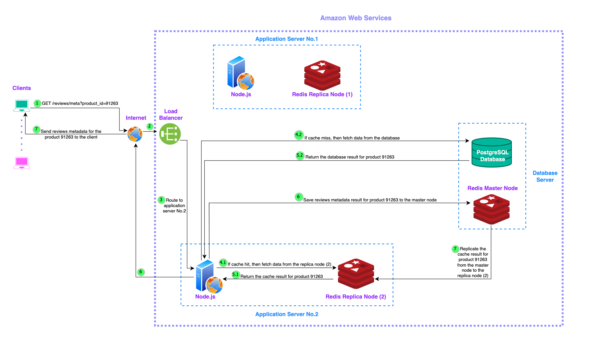
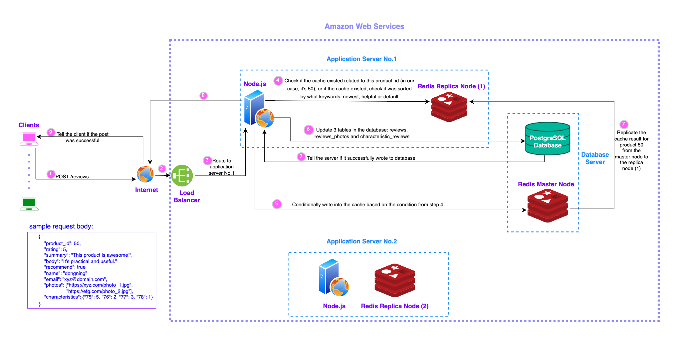

# About The Project
Build, deploy and scale a back end system to support the Ratings & Reviews microservice of an E-Commerce platform.

## Built With

## System Design Diagrams (created using [draw.io](https://www.drawio.com/))
• Diagram for GET requests:

• Diagram for POST requests:

## Thought Process & Results
### **Phase 1 (Sep 20, 2022 - Nov 30, 2022)**
When I started, I only focused on speeding up GET requests. There are over 20M records related to Reviews & Ratings in my database. How do I allow users to fetch their data quickly? In addition to optimizing SQL queries, I made the decision to use PostgreSQL Materialized views and a horizontal scaling strategy: load balancing. After creating two Materialized views, users could fetch data from the cache results instead of getting them from tables. These changes increased my RPS (Requests Per Second) numbers, while maintaining a low error rate (<1%) and low latency (<150ms). Here is a comparasion: 
  

***Before Deployment (initial results without any optimization)*** :

    
    

  You can see from the above records, both GET requests were super slow: 
  * For GET /reviews, the average response times were over 6s per request.
  * For GET /reviews/meta, the average response times were over 12s per request.

***After Deploying on AWS (Strategy: SQL query optimization + Materialized views + Load balancer)*** :

    
    

  After database tuning and horizontal scaling, both GET requests sped up significantly:
  * For GET /reviews, the application could handle 2700 RPS.
  * For GET /reviews/meta, the application could handle 2800 RPS.

### **Phase 2 (July 27, 2023 - Present)**
I will attach results soon :)
